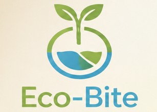
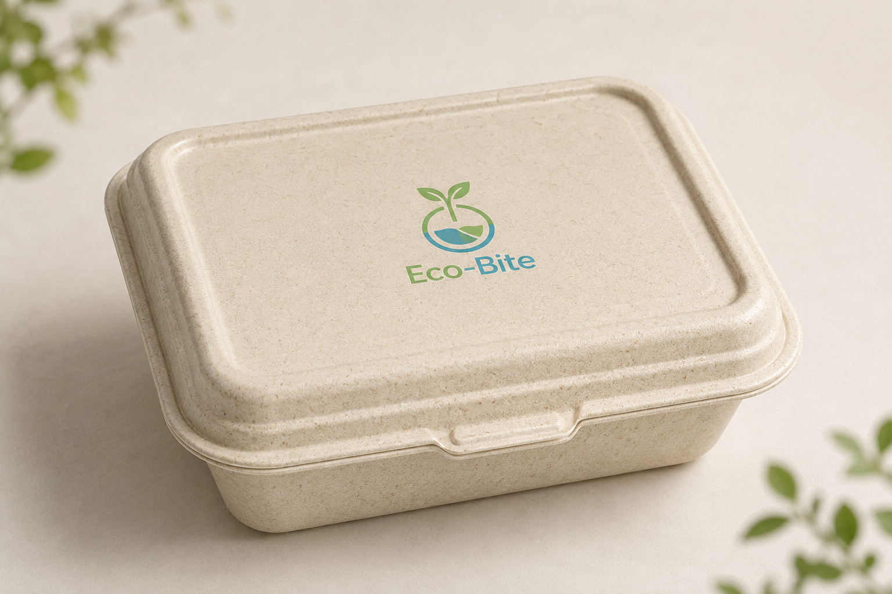
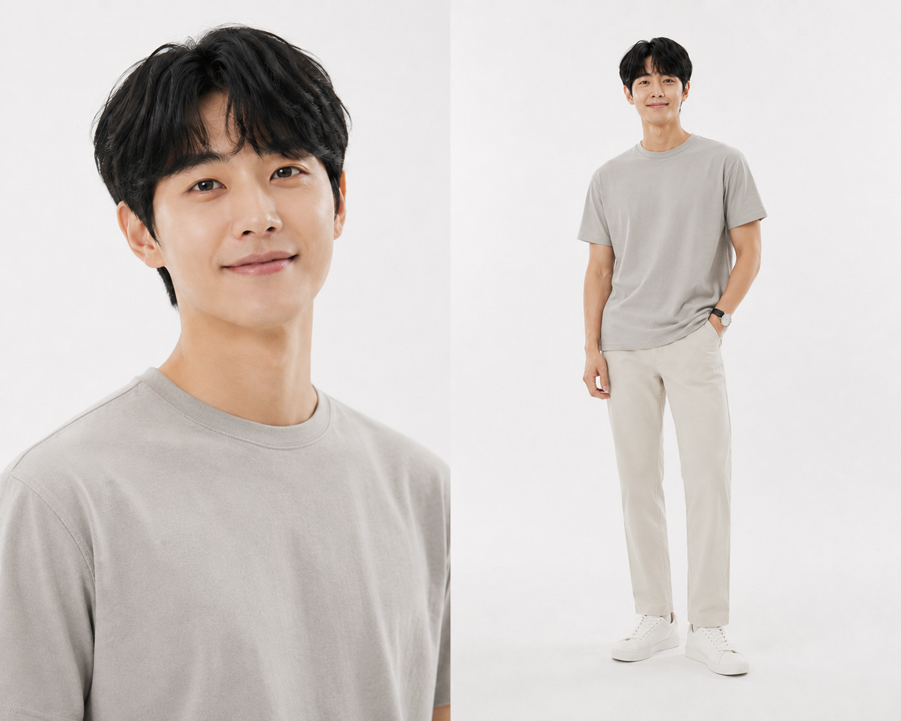
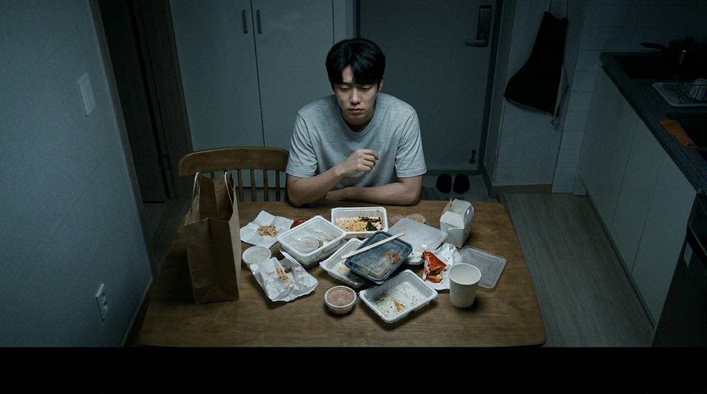
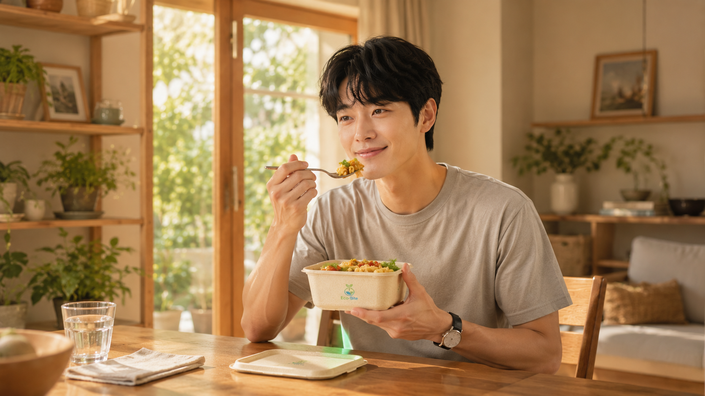
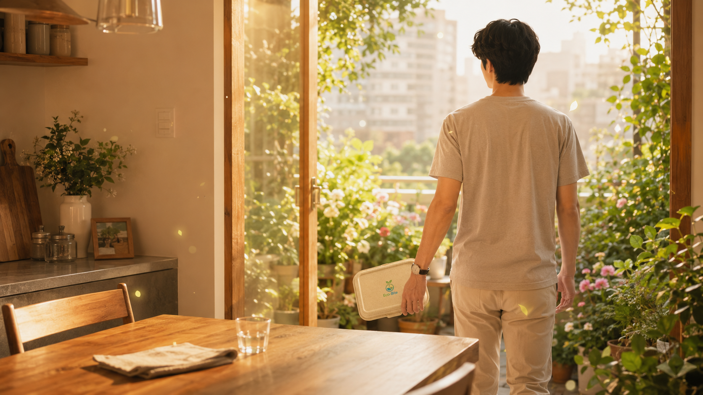
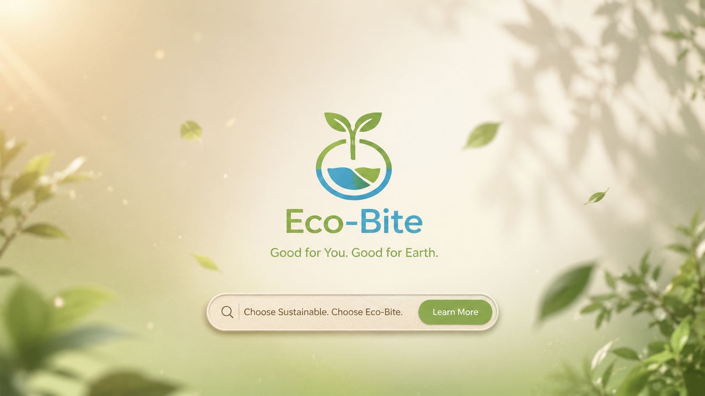
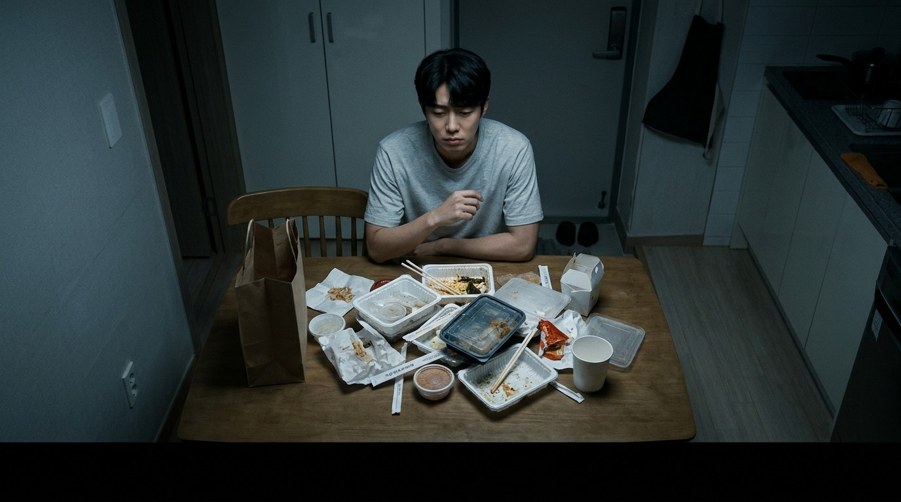

# 🎬 AI 기반 브랜드 광고 기획 및 스토리보드

## 1. 브랜드 아이덴티티 및 캠페인 정의

### 1.1 브랜드 기본 정보

<p align='center'>
  
</p>

- **브랜드명:** "에코 바이트 (Eco-Bite)" (가상의 친환경 용기 브랜드)
- **타겟 고객:** 환경 보호에 관심이 많고 배달/테이크아웃을 자주 이용하는 2030 1인 가구 및 친환경 가치 소비층.
- **톤앤매너:** 내추럴 오가닉, 생동감 넘치는 Magical Realism(마술적 사실주의: 실제+환상), 시네마틱, 따뜻하고 희망찬 무드.
- **차별점 (USP):** 감자 전분과 곡물 껍질로 만든 100% 생분해성 식가공 용기로, 버려진 후 한 달 내에 천연 영양제로 분해되어 식물을 피워내는 가치 제공.

### 1.2 캠페인 전략
- **광고의 목적:** 브랜드 런칭 및 혁신적인 친환경 제품 인지(Awareness)
- **핵심 메시지:** "맛있게 드세요, 용기까지 지구에게 양보하세요."

---

## 2. 메인 스토리보드 (Scene-by-Scene)

<details>
<summary>[키 비주얼]</summary>
<br>

**<제품 키 비주얼>**

프롬프트 (GPT-image):
```text
광고 영상에 나오는 product를 AI 이미지로 제작하려 합니다. "곡물 질감이 살아있는 미색(Oatmeal color)의 에코 바이트 용기. 에코 바이트 용기에는 중앙에 새싹 모양이 결합된 'Eco-Bite' 브랜드 로고가 있고 이 로고는 초록색과 파란색으로 은은하게 인쇄되어 있음."를 이용하여 적절한 이미지를 생성해 주세요. 광고 설명: "에코 바이트(Eco-Bite)" 친환경 용기 광고 전체 콘셉트 요약 - 핵심 메시지: "맛있게 드세요, 용기까지 지구에게 양보하세요"라는 카피처럼, 일상 속 작은 배달앱 선택이 쓰레기 대신 자연을 피워내는 위대한 변화를 만든다는 가치를 전달합니다. - 스타일: 일상적인 현실(배달 주문)에 초현실적이고 신비로운 시각 효과(화단에서 팝콘처럼 터지는 개화 모션)를 결합한 매지컬 리얼리즘(Magical Realism) 스타일을 지향합니다. - 분위기: 초반의 무겁고 씁쓸한 일상의 죄책감에서 시작해, 에코 바이트를 선택한 이후부터는 싱그럽고 경이로우며 마법 같은 따뜻하고 희망찬 분위기로 반전됩니다. - 색감: 초반의 어둡고 탁한 도시의 플라스틱 톤에서, 에코 바이트 등장 이후 햇살 가득한 웜 오렌지(Warm Orange)와 자연의 생명력이 넘치는 오가닉 그린(Organic Green) 중심의 따뜻한 시네마틱 색감으로 전환됩니다.
```



---

**<인물 키 비주얼>**

프롬프트 (GPT-image):
```text
Please generate two images of this male (one face-shot and one full-body shot) on a white background. Here is the description: "Ultra-realistic Korean male, 27 years old, modern office worker and urban single-person household resident, natural and relatable appearance, warm and approachable face, clear skin, dark brown eyes, neat black hair with soft texture and natural volume, slim athletic build, height around 178cm. Wearing a casual smart outfit: short-sleeved t-shirt, light beige chinos, clean white sneakers. Minimal accessories, simple wristwatch."
```



참고: Flow를 이용해서도 생성했지만 GPT-image 인물 이미지 결과가 더 나아서 GPT-image 생성 이미지 선택.

<br>
</details>

### ◼️ 씬 1 (Intro: 일상의 문제 제기)



- **씬 길이:** 7.5초 (누적: 7.5초)
- **목표 메시지:** 배달 음식을 먹은 뒤 쌓이는 플라스틱 쓰레기에 대한 죄책감 자극.
- **화면 구성:** 어두운 방 안, 테이블 위에 플라스틱 일회용 용기들이 지저분하게 쌓여 있는 모습. 한 한국 20대 청년이 한숨을 쉬며 쓰레기를 바라보는 시네마틱 탑다운 뷰(Top-down view).
- **내레이션 / 카피:** (내레이션) "오늘도 맛있게 먹었지만, 마음은 무거우셨나요?"
- **사용 도구 및 목적:**
  - 이미지: `Flow - Nano Banana 2` ➔ 생성된 인물 키 비주얼로 입력 프롬프트를 사용하여 Flow에서 씬 이미지 생성.
  - 비디오: `Flow - Omni Flash` ➔ 카메라가 위에서 아래로 천천히 줌인(Zoom-in)하는 미세 모션 추가.
  - 오디오 BGM: `Suno` ➔ 애잔하고 감성적인 배경음악.
  - 오디오 TTS: `Supertone` ➔ 차분한 내레이션.
- **입력 프롬프트:**

  <details>
  <summary>[이미지]</summary>
  <br>

  _A cinematic top-down view of a small, dimly lit apartment dining table cluttered with empty plastic takeout containers, disposable utensils, and food packaging. A single used wooden chopstick is placed directly inside the container in front of the man. A 27-year-old Korean man sits alone at the table, staring at the pile of waste with a tired expression and a subtle sigh, conveying guilt and discomfort. The room is filled with cold, muted gray-blue tones, creating a heavy and somber atmosphere that reflects the environmental impact of everyday convenience. Realistic urban lifestyle photography, dramatic shadows, shallow depth of field, emotional storytelling, high-end commercial film still, ultra-realistic, 8K. Empty space at the bottom of the frame reserved for subtitle text. 16:9 aspect ratio._
  
  <br>
  </details>

  <details>
  <summary>[비디오]</summary>
  <br>

  * Start: 씬 1 이미지
  * `Flow - Omni Flash`, Frames, 16:9, 1x, 6s ➔ 생성 후 속도를 줄여 7.5s로 만듦

  _Slow cinematic top-down push-in. The young man slowly lowers his gaze toward the pile of plastic takeout containers, sighs softly, and slightly slumps his shoulders. The camera gradually tightens on the waste, emphasizing guilt and environmental burden. Faint dust particles drift through the dim room. Cold gray-blue atmosphere, realistic motion, emotional commercial film style._
  
  <br>
  </details>
  
  <details>
  <summary>[오디오 BGM]</summary>
  <br>

  _Cinematic ambient piano, modern eco-commercial soundtrack, reflective and slightly melancholic mood, felt piano, soft string pads, subtle ambient textures, gentle organic sound design, minimal instrumentation, emotional but not sad, warm and human, slow tempo around 68 BPM, spacious reverb, delicate piano motifs, introspective atmosphere, premium documentary-commercial style, environmental awareness theme, cinematic realism, understated and elegant. Instrumental only, no vocals._

  </details>
  <br>

- **출력 결과 요약 (한 줄):** 플라스틱 쓰레기가 강조된 현대인의 리얼하고 어두운 일상 단면 연출.
- **생성 결과 파일명:** `scene1_plastic-waste.png` / `scene1_plastic-waste.mp4` / `scene1_plastic-waste_bgm.mp3` / `scene1_plastic-waste_tts.wav`

---

### ◼️ 씬 2 (Concept: 배달앱에서의 '에코 바이트' 선택)


- **씬 길이:** 6초 (누적: 13.5초)
- **목표 메시지:** 소비자가 배달앱에서 직접 친환경 용기를 '선택'할 수 있다는 서비스 전제 제시.
- **화면 구성:** 깔끔한 스마트폰 화면 클로즈업. 배달앱 음식 주문 결제창 가상 UI가 보임. 화면 중앙의 `[✓] 에코 바이트 용기로 변경 (+500원)` 체크박스를 손가락으로 가볍게 터치(Tap)하자, 초록색 불이 들어오며 반짝이는 모션. 배경은 따뜻하고 감성적인 주방.
- **내레이션 / 카피:** (내레이션) "이제 주문할 때 체크하세요. 지구를 구하는 가장 쉬운 선택."
- **사용 도구 및 목적:**
  - 이미지: `GPT-image` ➔ 배달앱 UI가 띄워진 스마트폰을 든 손의 감성적인 시네마틱 컷 생성
  - 비디오: `Flow - Omni Flash` ➔ 손가락이 화면을 터치할 때 미세한 화면 움직임과 초록색 체크 마크가 활성화되는 모션 추가.
  - 오디오 TTS: `Supertone` ➔ 희망적이고 다정한 톤의 내레이션. (참고: 배경 음악은 넣지 않음. 그 전 씬이 어두운 분위기여서 내레이션과 영상에 집중하기 위해서.)
- **입력 프롬프트:** 

    <details>
    <summary>[이미지]</summary>
    <br>

    _A cinematic close-up of a young Korean man (clear skin; short-sleeved t-shirt)'s hand holding a modern smartphone while ordering food through a delivery app. On the payment screen, a clean and minimalist UI displays a green option labeled "[✓] 에코 바이트 용기로 변경 (+500원)"(in Korean language) with a small leaf icon, and the finger gently taps the checkbox. The moment the option is selected, a soft green glow radiates from the button, releasing subtle sparkling particles and tiny floating leaf-shaped lights, suggesting the beginning of a magical environmental change. The background is a warm, sunlit kitchen with soft bokeh, featuring warm orange and organic green tones that create a hopeful and uplifting atmosphere. Ultra-realistic commercial photography, magical realism, shallow depth of field, premium advertising campaign, cinematic lighting, photorealistic, 16:9 aspect ratio, 8K._

    참고) 씬 2부터 GPT-image에 생성한 인물 키 비주얼을 Flow에 업로드 하는 과정에서 경고문 발생 "Our policies prohibit uploading of prominent people at this time. Please try a different image or send feedback.". 따라서 이미지 생성에 GPT-image 사용 결정 (그리고 GPT-image가 이미지를 더 사실적이고 상세하게 생성했기 때문에).

    <br>
    </details>

    <details>
    <summary>[비디오]</summary>
    <br>

    * Start: 씬 2 이미지
    * `Flow - Omni Flash`, Frames, 16:9, 1x, 6s

    _Slow cinematic push-in toward the smartphone screen. The finger gently taps the Eco-Bite checkbox, triggering a soft green glow. Tiny sparkling particles and leaf-shaped lights emerge from the button and drift naturally through the frame. Warm, hopeful atmosphere, realistic motion, premium commercial film style._

    참고) 앱에 한글을 조금 알아볼 수 없지만 이를 개선할 방법은 프롬프트로 없다고 함. 프롬프트에 한글 글씨 그대로 나오게 해달라고 요청했지만 그래도 깨져서 나옴.

    </details>
    <br>

- **출력 결과 요약 (한 줄):** 배달앱에서 소비자가 직접 에코 바이트 용기를 선택하는 직관적인 UI 모션 구현.
- **생성 결과 파일명:** `scene2_app-select.png` / `scene2_app-select.mp4` / `scene2_app-select_tts.wav`

---

### ◼️ 씬 3 (Development: 친환경 배달 음식 수령 및 식사)



- **씬 길이:** 6초 (누적: 19.5초)
- **목표 메시지:** 내가 선택한 에코 바이트 용기에 담긴 음식을 죄책감 없이 건강하고 맛있게 즐기는 모습 연출.
- **화면 구성:** 햇살이 은은하게 들어오는 거실 테이블. 오트밀 질감의 에코 바이트 용기에 신선하고 색감이 다채로운 샐러드 파스타가 가득 담겨 있음. 주인공이 환하게 웃으며 음식을 맛있게 먹는 미디엄 숏(Medium shot). 플라스틱 용기를 쓸 때와 대비되는 편안하고 내추럴한 연출.
- **내레이션 / 카피:** (내레이션) "플라스틱 쓰레기 걱정 없이, 오늘 한 끼도 맛있고 가볍게."
- **사용 도구 및 목적:**
  - 이미지: `GPT-image` ➔ 에코 바이트 용기에 담긴 신선한 샐러드와 이를 즐기는 인물의 따뜻하고 자연스러운 키 비주얼 생성.
  - 비디오: `Flow - Omni Flash` ➔ 포크로 음식을 집어 올리거나 인물이 미소를 지으며 맛있게 먹는 자연스러운 생활 모션 부여.
  - 오디오 TTS: `Supertone` ➔ 편안함과 만족감이 느껴지는 다정한 톤의 내레이션. (참고: 배경 음악은 넣지 않음. 등장 인물이 음식을 씹는 소리와 내레이션에 집중하기 위해서.)
- **입력 프롬프트:** 

  <details>
  <summary>[이미지]</summary>
  <br>

  _A cinematic medium shot of a 27-year-old Korean man enjoying a fresh and colorful salad pasta from an Eco-Bite container in a bright, sunlit living room. The biodegradable container is made of oatmeal-colored natural fiber material with visible grain texture, featuring a subtle green-and-blue Eco-Bite logo with a sprouting leaf symbol. Warm morning sunlight streams through large windows, illuminating vibrant vegetables, fresh ingredients, and natural wooden furniture, creating a calm and uplifting atmosphere. The man smiles naturally as he takes a bite, looking relaxed, satisfied, and completely free from environmental guilt, embodying a healthier and more sustainable lifestyle. Ultra-realistic commercial photography, warm orange and organic green color palette, cozy modern interior, natural lifestyle advertising, shallow depth of field, emotional storytelling, photorealistic, premium cinematic quality, 16:9 aspect ratio, 8K._

  <br>
  </details>

  <details>
  <summary>[비디오]</summary>
  <br>

  * Start: 씬 3 이미지
  * `Flow - Omni Flash`, Frames, 16:9, 1x, 6s

  _Slow cinemaic push-in toward the young man enjoying his meal. He gently lifts a forkful of salad pasta, takes a bite, and smiles naturally with a relaxed and satisfied expression. He briefly glances at the Eco-Bite container before continuing to enjoy his meal. Subtle sunlight flickers across the table while the Eco-Bite container remains clearly visible in the foreground. Warm, comfortable atmosphere, realistic lifestyle motion, natural eating behavior, premium commercial cinematography, slow and uplifting pacing._

  </details>
  <br>

- **출력 결과 요약 (한 줄):** 친환경 용기 덕분에 플라스틱 죄책감 없이 행복하게 식사하는 감성적 장면 연출.
- **생성 결과 파일명:** `scene3_eating-happy.png` / `scene3_eating-happy.mp4` / `scene3_eating-happy_tts.wav`

---

### ◼️ 씬 4 (Action: 식사 후 정원으로 이동)



- **씬 길이:** 4.4초 (누적: 23.9초)
- **목표 메시지:** 내가 선택한 에코 바이트 용기에 담긴 음식을 맛있게 즐긴 후 자연으로 향하는 행동 묘사.
- **화면 구성:** 따뜻한 햇살이 비치는 주방 테이블 위, 곡물 질감이 살아있는 미색(Oatmeal color)의 에코 바이트 용기에 담긴 샐러드를 맛있게 비운 주인공. 에코 바이트 용기에는 'Eco-Bite' 로고가 초록색과 파란색으로 은은하게 인쇄되어 있음. 빈 용기를 들고 싱그러운 초록 정원이나 베란다 화단으로 걸어나가는 뒷모습.
- **내레이션 / 카피:** (내레이션) "맛있게 비웠다면 쓰레기통 말고, 화단으로 가세요."
- **사용 도구 및 목적:**
  - 이미지: `GPT-image` ➔ 곡물 질감의 빈 용기를 들고 싱그러운 정원으로 걸어나가는 주인공 컷 생성.
  - 비디오: `Flow - Omni Flash` ➔ 카메라가 인물의 동선을 부드럽게 따라가는 패닝(Panning) 무브먼트 구현.
  - 오디오 TTS: `Supertone` ➔ 한층 밝아지고 호기심을 유도하는 경쾌한 톤의 내레이션 연출.
- **입력 프롬프트:** 
    
  <details>
  <summary>[이미지]</summary>
  <br>

  _A cinematic medium-wide shot of a 27-year-old Korean man in a sunlit apartment kitchen after finishing his meal. On the wooden dining table sits an empty Eco-Bite container made of biodegradable oatmeal-colored material with visible grain texture, featuring a subtle green-and-blue Eco-Bite logo with a sprouting leaf design. Warm sunlight streams through the window, bathing the scene in rich warm orange tones as the man gently picks up the empty container and walks toward a lush balcony garden filled with vibrant green plants and flowers. Seen from behind, he steps toward the greenery with a sense of purpose and optimism, while tiny floating particles and soft leaf-like sparkles subtly hint at the magical transformation to come. Ultra-realistic commercial photography, magical realism, cinematic storytelling, organic green and warm orange color palette, shallow depth of field, premium advertising campaign, photorealistic, 16:9 aspect ratio, 8K._

  <br>
  </details>

  <details>
  <summary>[비디오]</summary>
  <br>

  * Start: 씬 4 이미지
  * `Flow - Omni Flash`, Frames, 16:9, 1x, 6s ➔ 생성 후 뒷부분 1.6s 삭제

  _Slow cinematic tracking shot following the man from behind as he walks toward the sunlit balcony garden holding the empty Eco-Bite container. The camera gently pans with his movement, creating a smooth and uplifting sense of progression. Warm sunlight filters through the plants while subtle leaf-shaped particles drift through the air, hinting at the magical transformation to come. Natural walking motion, optimistic mood, premium commercial cinematography, realistic movement, warm and inviting atmosphere._

  </details>
  <br>

- **출력 결과 요약 (한 줄):** 식사 후 친환경 용기를 들고 자연 친화적인 공간이나 화단으로 이동하는 주인공의 경쾌한 움직임 연출.
- **생성 결과 파일명:** `scene4_heading-to-balcony.png` / `scene4_heading-to-balcony.mp4` / `scene4_heading-to-balcony_tts.wav`

---

### ◼️ 씬 5 (Climax: 마법 같은 생분해 모션 - 핵심 비주얼)


- **씬 길이:** 6초 (누적: 29.9초)
- **목표 메시지:** 용기가 분해되며 꽃이 피어나는 브랜드의 핵심 시각 퍼포먼스(영양제 효과) 표현.
- **화면 구성:** 주인공이 용기를 화단 흙 위에 '툭' 던지자, 용기가 부서지며 흙 속으로 순식간에 흡수됨. 그 자리에서 형형색색의 아름다운 꽃들이 팝콘처럼 '팡팡' 터지며 초고속으로 피어나는 매지컬 모션 그래픽.
- **내레이션 / 카피:** 없음 (영상과 배경음악에 집중하기 위해서)
- **사용 도구 및 목적:**
  - 이미지: `GPT-image` ➔ 부서진 용기 사이로 다채로운 꽃들이 피어오르는 경이로운 찰나의 순간을 실제 사진처럼 생성 (Flow는 애니매이션 같이 생성해서 폐기).
  - 비디오: `Flow - Veo 3.1 Lite` ➔ Start와 End이미지를 사용하여 꽃이 초고속(Time-lapse)으로 팡팡 터지며 개화하는 극적인 효과 부여 후 황금빛 햇살이 넘치는 꽃들로 가득찬 초원으로 전환.
  - 오디오 BGM: `Suno` ➔ 경이로움과 희망을 주는 우아한 감정 고조 배경음악이 필요.
- **입력 프롬프트:**

  <details>
  <summary>[이미지]</summary>
  <br>

  _A breathtaking magical realism scene in a lush garden flowerbed bathed in warm golden sunlight. An Eco-Bite biodegradable container made of oatmeal-colored natural fiber material gently lands on the soil, instantly breaking apart and dissolving into the earth as glowing organic particles flow beneath the surface. From the exact spot where the container disappears, vibrant flowers in shades of orange, yellow, pink, purple, and white burst upward like popcorn explosions, blooming at extraordinary speed in a mesmerizing time-lapse spectacle. Swirling particles of light, floating petals, and sparkling leaf-shaped energy fill the air, transforming the garden into a living celebration of renewal and life. Ultra-realistic cinematic photography, magical realism, organic fantasy, warm orange and organic green color palette, high dynamic range, volumetric sunlight, premium commercial advertising hero shot, photorealistic, 16:9 aspect ratio, 8K._

  <br>
  </details>

  <details>
  <summary>[비디오]</summary>
  <br>

  * Start: 씬 5 이미지
  * End: 씬 6 이미지
  * `Flow - Veo 3.1 Lite`, Frames, 16:9, 1x (8s) ➔ 뒷부분 2s 삭제 후 6s로 만듦

  _Slow cinematic zoom-out and slight upward camera movement. The Eco-Bite biodegradable container gradually decomposes into tiny natural fiber particles that dissolve into the environment. As it disappears, colorful wildflowers continuously sprout and bloom from the soil, spreading outward in a magical time-lapse transformation. The flower field continuously expands across the landscape until it becomes a vast meadow overflowing with vibrant blossoms, matching the final scene. Warm golden-hour sunlight, drifting petals, sparkling pollen, volumetric light rays, ultra-realistic cinematic photography, premium commercial advertising, magical realism, smooth natural motion._

  참고) `Flow - Omni Flash`에서는 Start이미지만 넣을 수 있고 End이미지를 넣을 수 없음. `Flow - Veo 3.1 Lite`에서는 End 이미지도 넣을 수 있어서 `Veo 3.1 Lite` 사용.

  <br>
  </details>
  
  <details>
  <summary>[오디오 BGM]</summary>
  <br>

  (씬 5,6에 사용)
  * `Lyrics`(가사)는 빈 칸으로 놓고, 
  * `Styles` 에 아래 프롬프트 작성:

  _Neo-classical cinematic soundtrack with organic acoustic elements, warm piano, intimate strings, subtle cello, light percussion, evolving orchestration, magical and inspiring mood, environmental transformation, wonder and hope, elegant emotional build, premium advertising music, golden sunlight atmosphere, cinematic storytelling, moderate tempo 92 BPM, emotional climax during blooming flower transformation, gentle uplifting finale, instrumental only._

  </details>
  <br>

- **출력 결과 요약 (한 줄):** 용기가 천연 영양제로 변해 꽃을 피우는 매지컬 리얼리즘의 시각적 절정.
- **생성 결과 파일명:** `scene5_flower-burst.png` / `scene5_flower-burst.mp4` / `scene5_flower-burst_bgm.mp3`

---

### ◼️ 씬 6 (Message: 핵심 슬로건 전달)


- **씬 길이:** 6.1초 (누적: 36초)
- **목표 메시지:** 광고의 핵심 카피를 시각/청각으로 각인시키며 감동 선사.
- **화면 구성:** 흐드러지게 피어난 아름다운 꽃밭을 배경으로, 부드러운 햇살 속에서 화면 중앙에 감성적인 타이포그래피로 핵심 카피가 부드럽게 나타남 (Fade-in). 중간에 자막을 위해서 공간을 비워둠. 
- **내레이션 / 카피:** (내레이션/자막) "맛있게 드세요, 용기까지 지구에게 양보하세요."
- **사용 도구 및 목적:**
  - 이미지: `GPT-image` ➔ 풍성하고 아름다운 햇살 가득한 꽃밭 배경 소스 생성.
  - 비디오: `Flow - Omni Flash` ➔ 꽃들이 바람에 살랑살랑 흔들리고 햇살 파편이 부서지는 감성적인 루프 모션.
  - 오디오 TTS: `Supertone` ➔ 따뜻함과 진정성이 느껴지는 톤으로 핵심 내레이션 강조.
- **입력 프롬프트:** 

  <details>
  <summary>[이미지]</summary>
  <br>

  _A breathtaking cinematic landscape filled with thousands of blooming flowers stretching across a vibrant garden, glowing under warm golden-hour sunlight. Gentle wind moves through the colorful blossoms, creating soft waves of motion while floating particles of light and delicate flower petals drift gracefully through the air. The scene radiates warmth, hope, and renewal, with rich organic green foliage and vibrant floral colors illuminated by dreamy volumetric sunlight. At the center of the frame, ample negative space is reserved for elegant fade-in typography displaying the campaign message, creating a premium emotional advertising finale. Ultra-realistic photography, magical realism, warm orange and organic green color palette, serene and inspiring atmosphere, cinematic depth of field, premium brand commercial, photorealistic, 16:9 aspect ratio, 8K._

  <br>
  </details>

  <details>
  <summary>[비디오]</summary>
  <br>

  * Start: 씬 6 이미지
  * `Flow - Omni Flash`, Frames, 16:9, 1x, 4s ➔ 생성 후 속도를 줄여 6s로 만듦

  _Slow cinematic push-in over a vast blooming flower meadow. Warm golden-hour sunlight streams through the scene as flower petals drift gently in the air. Sparkling pollen particles float softly above the flowers, creating a magical yet natural atmosphere. The camera glides forward with subtle motion while elegant typography gradually fades in at the center in Korean language: "맛있게 드세요, 용기까지 지구에게 양보하세요." Premium commercial advertising, magical realism, ultra-realistic cinematic photography, soft depth of field, organic motion, inspiring and hopeful mood._

  </details>
  <br>

- **출력 결과 요약 (한 줄):** 핵심 카피와 어우러지는 따뜻하고 아름다운 자연의 엔딩 무드 완성.
- **생성 결과 파일명:** `scene6_golden-field.png` / `scene6_golden-field.mp4` / `scene6_golden-field_tts.wav`

---

### ◼️ 씬 7 (Outro: 브랜드 인지 및 CTA)



- **씬 길이:** 6초 (누적: 42초)
- **목표 메시지:** 브랜드 로고와 웹사이트 주소를 노출하여 구매 및 검색 유도.
- **화면 구성:** 깨끗하고 미니멀한 오가닉 그린 배경. 중앙에 새싹 모양이 결합된 'Eco-Bite' 브랜드 로고와 슬로건이 선명하게 등장. 하단에 검색창 그래픽과 CTA 문구 배치.
- **내레이션 / 카피:** 없음 (브랜드에 집중하게 하기 위해서).
- **사용 도구 및 목적:**
  - 이미지: `GPT-image` ➔ 브랜드의 정체성을 보여주는 미니멀하고 깨끗한 오가닉 그린 그라데이션 배경 생성.
  - 비디오: `Flow - Omni Flash` ➔ 로고 및 검색창 그래픽 모션 타이핑 효과 적용.
- **입력 프롬프트:** 

  <details>
  <summary>[이미지]</summary>
  <br>

  _A clean and minimalist brand end card featuring a soft organic green and oatmeal-beige gradient background inspired by nature and sustainable living. Gentle sunlight creates a subtle glow across the scene, while faint floating leaf particles and soft botanical shadows add elegance without distracting from the central branding. In the center of the frame, ample negative space is reserved for the Eco-Bite logo featuring a sprouting leaf symbol, accompanied by a refined sustainability-focused tagline. At the bottom of the composition, a modern search bar graphic is elegantly integrated with space for a call-to-action message, creating a premium and memorable commercial finale. Ultra-realistic studio lighting, modern eco-friendly brand identity, clean composition, warm orange and organic green accents, high-end advertising design, photorealistic, 16:9 aspect ratio, 8K._

  <br>
  </details>

  <details>
  <summary>[비디오]</summary>
  <br>

  * Start: 씬 7 이미지
  * `Flow - Omni Flash`, Frames, 16:9, 1x, 4s ➔ 생성 후 속도를 줄여 6s로 만듦

  _Clean cinematic brand end card. Soft organic sunlight and gentle leaf shadows move naturally across the background. Small green leaves drift slowly through the air while subtle floating particles create a premium eco-friendly atmosphere. The Eco-Bite logo remains sharp and centered as the camera performs a very slow, elegant push-in. The slogan and search bar stay clearly visible while ambient natural motion enhances the scene. Premium commercial advertising, minimalist design, warm organic color palette, ultra-realistic lighting, luxury brand reveal, smooth motion, polished product launch aesthetic._

  </details>
  <br>

- **출력 결과 요약 (한 줄):** 가독성을 극대화한 미니멀 오가닉 배경 위 브랜드 아이덴티티 최종 각인.
- **생성 결과 파일명:** `scene7_brand.png` / `scene7_brand.mp4`

---

## 3. 최종 영상 파일 정보

- **최종 파일명:** `eco-bite.mp4`
- **유튜브 링크:** [eco-bite](https://youtu.be/iHyX0dlCTBQ)
- **총 재생 시간:** 42초
- **해상도:** 1920x1080 (1080p)
- **프레임레이트:** 30fps
- **코덱:** H.264 / AAC

---

## 4. 프롬프트 개선 로그

### ◼️ 씬 1 프롬프트 개선 기록
- **수정 전 프롬프트 (원문):** `A cinematic top-down view of a small, dimly lit apartment dining table cluttered with empty plastic takeout containers, disposable utensils, and food packaging. A 27-year-old Korean man sits alone at the table, staring at the pile of waste with a tired expression and a subtle sigh, conveying guilt and discomfort. The room is filled with cold, muted gray-blue tones, creating a heavy and somber atmosphere that reflects the environmental impact of everyday convenience. Realistic urban lifestyle photography, dramatic shadows, shallow depth of field, emotional storytelling, high-end commercial film still, ultra-realistic, 8K. Empty space at the bottom of the frame reserved for subtitle text. 16:9 aspect ratio.`
- **발생한 문제점:** 혼자서 먹었는데 나무 젓가락이 여러 개 놓여져 있는 이미지가 생성됨 (Flow, GPT-image 둘 다).
- **수정 후 프롬프트 (원문):** `A cinematic top-down view of a small, dimly lit apartment dining table cluttered with empty plastic takeout containers, disposable utensils, and food packaging. A single used wooden chopstick is placed directly inside the container in front of the man. A 27-year-old Korean man sits alone at the table, staring at the pile of waste with a tired expression and a subtle sigh, conveying guilt and discomfort. The room is filled with cold, muted gray-blue tones, creating a heavy and somber atmosphere that reflects the environmental impact of everyday convenience. Realistic urban lifestyle photography, dramatic shadows, shallow depth of field, emotional storytelling, high-end commercial film still, ultra-realistic, 8K. Empty space at the bottom of the frame reserved for subtitle text. 16:9 aspect ratio.`
- **결과 변화:** 의도대로 나무 젓가락이 한 개만 나옴.

<p align="center">
  <table>
    <tr>
      <td align="center">
        <figcaption>Flow: 수정 전</figcaption>
        
      </td>
      <td align="center">
        <figcaption>Flow: 수정 후</figcaption>
        
      </td>
    </tr>
  </table>
</p>

---

<details>
<summary>[용어 정리]</summary>
<br>

* **스토리보드(Storyboard):** 영화, 광고, 애니메이션, 앱/웹 개발 등에서 이야기를 시각적으로 미리 구성해 보는 장면별 설계도.
* **CTA (Call To Action):** 광고나 웹페이지에서 잠재 고객이 구체적인 행동을 하도록 유도하는 안내 문구 또는 버튼. "어떻게 그 혜택을 얻을 수 있는지"를 안내하여 구매나 구독을 완료하게 만듦. 망설이는 고객의 마음을 결심으로 바꾸는 트리거 역할을 함.
* **USP (Unique Selling Proposition):** 소비자가 제품을 구매해야 하는 고유한 이유. 제품의 차별화된 가치나 강점. "우리 제품이 얼마나 좋은지"를 알려 고객의 관심과 호기심을 유발함.
* **톤앤매너(Tone & Manner):** 브랜드, 디자인, 콘텐츠 등에서 느껴지는 '전반적인 분위기'와 '소통하는 태도'; 톤은 색감, 문체, 목소리 톤 등 표현하는 방식; 매너는 분위기, 스타일, 태도.
* **아웃트로(Outro):** 광고가 마무리되며 브랜드 정보를 각인시키고 다음 행동을 유도하는 종결부. 'Intro(도입부)'의 반대 개념으로, 영상이 자연스럽게 끝나도록 돕는 동시에 마케팅 목적을 달성하는 핵심적인 역할을 함. 일반적으로 아웃트로 씬에 포함되는 요소들은 브랜드 로고 및 슬로건 노출; 공식 웹사이트, SNS 계정 등 안내 문구; 제품 구매, 앱 다운로드 등의 행동 유도(Call To Action); 화면이 어두워지며 끝나는 페이드 아웃(Fade Out) 효과가 있음. 영상과 함께 브랜드 시그니처 사운드나 징글(로고송)을 삽입해 시청자에게 브랜드 이미지를 강하게 남김.
* **패닝 무브먼트 (Panning Movement):** 카메라를 삼각대 등에 고정해 둔 상태에서 카메라 머리만 좌우로 부드럽게 돌리며 넓은 풍경이나 움직이는 대상을 따라가는 촬영 기법.
* **미디엄 숏 (Medium Shot):** 인물의 허리나 가슴 부분부터 머리끝까지 화면에 담는 촬영 구도로, 인물의 표정 연기와 주변 배경의 상황을 동시에 균형 있게 보여주기에 좋음.
* **페이드 인 (Fade-in):** 아무것도 없는 어두운 상태(또는 흰 상태)에서 영상 화면이나 소리가 서서히 나타나며 장면이 시작되도록 만드는 연출 효과임.
* **사운드 로고 (Jingle / 징글):** 기업이나 브랜드의 이미지를 소비자의 뇌리에 강렬하게 각인시키기 위해 영상 도입부나 마지막에 사용하는 아주 짧고 독창적인 멜로디나 효과음.
* **해상도 (Resolution / 1080p):** 화면을 구성하는 가로 1920개, 세로 1080개의 정밀한 점(픽셀)의 수를 의미하며, 흔히 'Full HD(FHD)'라고 부르는 선명한 화질의 기준임.
* **프레임레이트 (Frame Rate / fps):** 1초 동안 화면에 보여주는 정지 화면(프레임)의 개수로, 24~30fps는 영화나 일반 방송처럼 부드럽고 자연스러운 움직임을 구현하는 표준적인 속도임.
* **비디오 코덱 (Video Codec / H.264):** 영상 데이터를 압축하고 해제하는 기술로, H.264는 화질 저하를 최소화하면서도 압축률이 뛰어나 현재 전 세계에서 가장 범용적으로 쓰이는 비디오 표준 규격임.
* **오디오 코덱 (Audio Codec / AAC):** 소리 데이터를 압축하고 해제하는 기술로, AAC는 MP3보다 음질이 우수하고 용량이 작아 현대 디지털 영상에서 표준으로 가장 많이 사용되는 오디오 규격임.

<br>
</details>